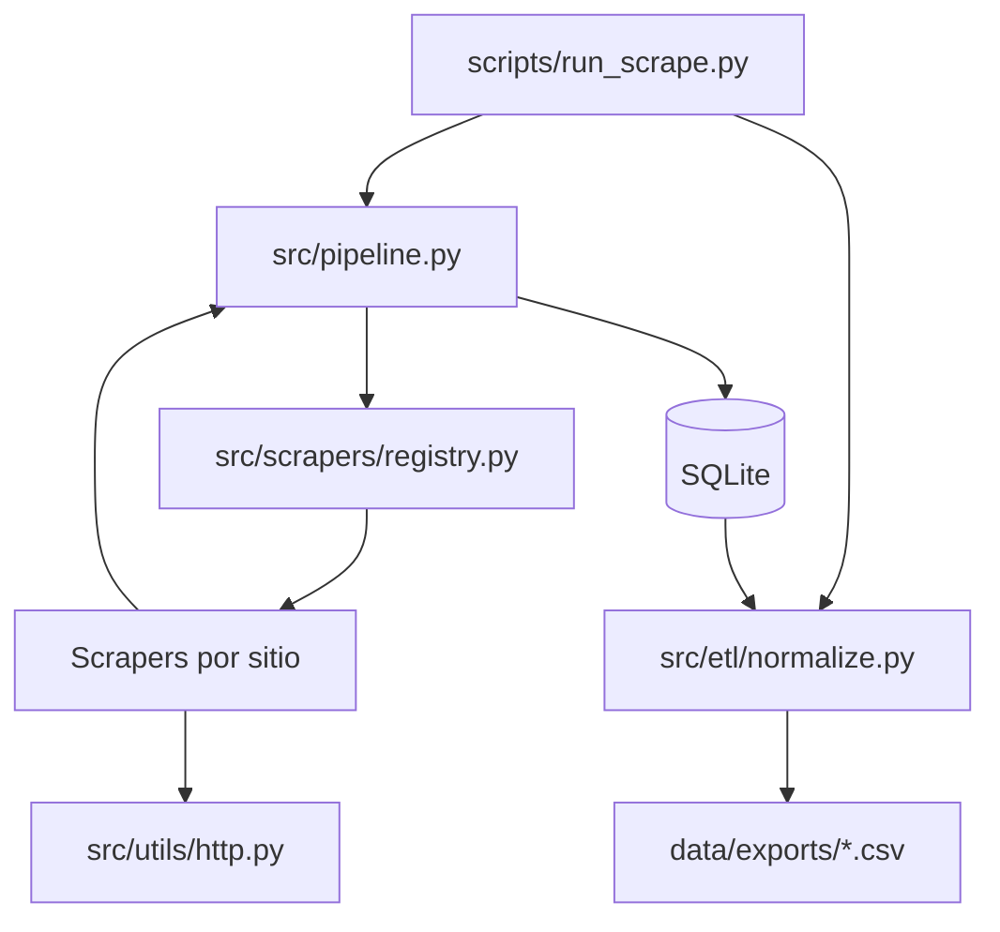

# Arquitectura

## Flujo de datos

## Capas

| Capa | Responsabilidad |
|------|-----------------|
| **Config** | `config/settings.yaml` + `config/sites/ar.yaml` y `cl.yaml` |
| **Scrapers** | Un módulo por familia: `tiendanube` (AR), `shopify` (CL), `woocommerce`, `configurable` |
| **Pipeline** | Orquesta sitios activos, persiste en DB, agrega estadísticas |
| **ETL** | Normaliza, deduplica y exporta resúmenes analíticos |

## Interfaz ScraperBase

Cada scraper implementa:

- `scrape_catalog(max_pages)` → URLs de producto
- `scrape_product(url)` → `ProductRecord`
- `run()` — iteración, validación y contadores OK/error/omitido

## Agregar un nuevo proveedor

1. Documentar en `documentos/fuentes.md`.
2. Añadir bloque en `config/sites.yaml` con `enabled: true`.
3. Elegir `scraper`: `tiendanube`, `shopify`, `woocommerce` o `configurable`.
4. Si hace falta lógica nueva, crear clase en `src/scrapers/` y registrarla en `registry.py`.
5. Añadir fixture HTML en `tests/fixtures/` y test de integración.
6. Correr `python scripts/run_scrape.py run --site nuevo_slug --max-products 5`.

## Exclusión MercadoLibre

- Dominios en `config/settings.yaml` → `excluded_domains`
- `HttpClient.get()` rechaza URLs de esos dominios antes de la petición

## Persistencia

SQLite en `data/uniforms.db`. Clave única: `(source, product_url, sku)` con upsert en cada corrida.
